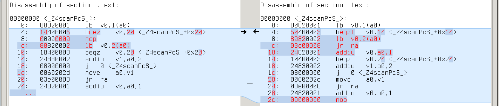
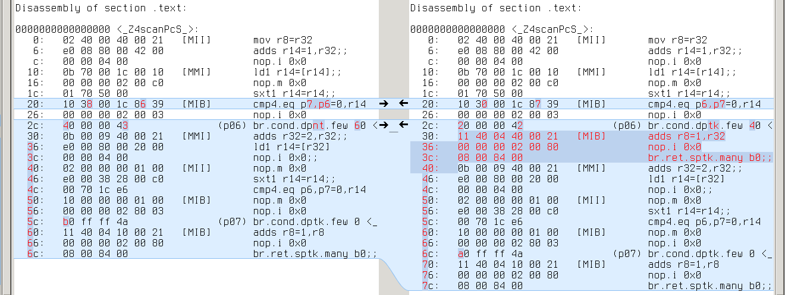
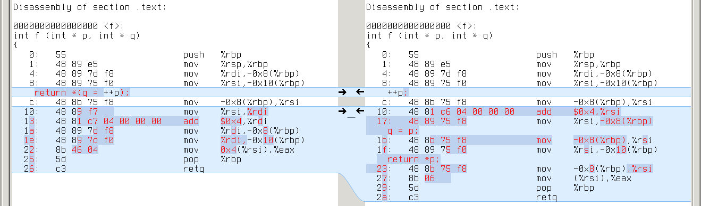
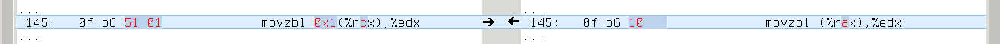

-----------------------------------
re2c input model: call for opinions
-----------------------------------

.. _RE2C: http://re2c.org/manual.html

.. _GENERIC: https://gcc.gnu.org/onlinedocs/gccint/GENERIC.html#GENERIC

.. _GIMPLE: <https://gcc.gnu.org/onlinedocs/gccint/GIMPLE.html#GIMPLE

.. _RTL: <https://gcc.gnu.org/onlinedocs/gccint/RTL.html#RTL>

RE2C_ is a generator of lexical analyzers for C/C++.
It takes a description of regular expressions, transforms it to deterministic finite automaton (DFA)
and compiles DFA to C/C++ code, which is further compiled to binary.
The resulting program --- LEXER --- accepts a string of characters
and tries to match it against the regular expressions encoded in DFA.
If the match is successful, LEXER performs some actions (predefined by the programmer).

.. image:: images/input_model_1.png

current input model: user-defined pointers
==========================================

LEXER operates on the input using four pointer-like primitives:

    ====           ==== ====
    YYCURSOR       ---> current character
    YYLIMIT        ---> end of input
    YYMARKER       ---> backtrack position
    YYCTXMARKER    ---> backtrack position for trailing context
    ====           ==== ====

and a function-like primitive YYFILL(n), which is invoked when LEXER needs more input.

.. image:: images/input_model_2.png

RE2C assumes that these primitives are defined by the programmer
so that LEXER can use them in the following way:

* ++YYCURSOR;
* yych = *YYCURSOR;
* yych = *++YYCURSOR;
* yych = *(YYMARKER = YYCURSOR);
* yych = *(YYMARKER = ++YCURSOR);
* yych = (YYCTYPE) *YYCURSOR;
* yych = (YYCTYPE) *++YYCURSOR;
* yych = (YYCTYPE) *(YYMARKER = YYCURSOR);
* yych = (YYCTYPE) *(YYMARKER = ++YCURSOR);
* YYCURSOR = YYMARKER;
* YYCURSOR = YYCTXMARKER;
* YYMARKER = YYCURSOR;
* YYMARKER = ++YYCURSOR;
* YYCTXMARKER = YYCURSOR + 1;
* if (YYLIMIT <= YYCURSOR) \...
* if ((YYLIMIT - YYCURSOR) < n) \...
* YYDEBUG (label, *YYCURSOR);

Each particular LEXER uses a subset of these cases, which depends on the complexity of regular expressions
and can be partially controlled by the programmer.

usual input: pointers to plain buffer
=====================================

The most obvious and efficient way to define pointer-like primitives is to make them simple pointers to a plain buffer:

.. image:: images/input_model_3.png

Like this:

.. code-block:: c

    bool lex
        ( char * cursor
        , char * limit
        , char * marker
        , char * ctxmarker
        )
    {
    #   define YYCTYPE     char
    #   define YYCURSOR    cursor
    #   define YYLIMIT     limit
    #   define YYMARKER    marker
    #   define YYCTXMARKER ctxmarker
    #   define YYFILL(n)   { return false; }
        /*!re2c
            "int buffer " / "[" [0-9]+ "]" { return true; }
            *                              { return false; }
        */
    }

    int main ()
    {
        char buffer [] = "int buffer [1024]";

        char * cursor    = buffer;
        char * limit     = buffer + sizeof (buffer);
        char * marker    = buffer;
        char * ctxmarker = buffer;

        return !lex (cursor, limit, marker, ctxmarker);
    }

unusual input: STL stream
=========================

Sometimes programmers want to give up efficiency for memory safety, simplicity and whatever else.
Why mess around with pointers to raw memory when we have STL streams?

RE2C lets the programmer use *any* input model, as long as it can be expressed in terms of pointer-like primitives.
And it almost certainly can --- the idea of iterators has been long around.

Say, we want to change the above example to work with std::istringstream.
All we need is an iterator with the following operations:

* dereference
* assignment
* prefix increment
* less-or-equal comparison
* addition of a constant offset
* substraction

And the following constraint:

* multiple iterators may be used simultaneously

None of standard iterators supports all the operations we need, so we can either
derive our iterator from a standard one or write it from scratch.
I did the latter:

.. code-block:: cpp

    class ptr_t
    {
        std::istringstream * is_;
        std::streampos p_;

      public:
        ptr_t (std::istringstream * is, std::streampos p)
            : is_ (is)
            , p_ (p)
        {}

        int operator * ()
        {
            is_->seekg (p_);
            return is_->peek ();
        }

        ptr_t & operator ++ ()
        {
            p_ += 1;
            return * this;
        }

        ptr_t operator + (std::streamoff off)
        {
            return ptr_t (is_, p_ + off);
        }

        friend bool operator <= (const ptr_t & ptr1, const ptr_t & ptr2)
        {
            return ptr1.p_ <= ptr2.p_;
        }

        friend std::streamoff operator - (const ptr_t & ptr1, const ptr_t & ptr2)
        {
            return ptr1.p_ - ptr2.p_;
        }
    };

This code is inefficient (notice that ugly 'seekg' in dereference operator), but very simple.
A more efficient implementation would provide different iterator types for YYCURSOR and all the rest.

That's how we use our iterator:

.. code-block:: c

    bool lex
        ( ptr_t & cursor
        , ptr_t & limit
        , ptr_t & marker
        , ptr_t & ctxmarker
        )
    {
    #   define YYCTYPE     char
    #   define YYCURSOR    cursor
    #   define YYLIMIT     limit
    #   define YYMARKER    marker
    #   define YYCTXMARKER ctxmarker
    #   define YYFILL(n)   { return false; }
        /*!re2c
            "int buffer " / "[" [0-9]+ "]" { return true; }
            *                              { return false; }
        */
    }

    int main ()
    {
        char buffer [] = "int buffer [1024]";
        std::istringstream is (buffer);

        ptr_t cursor    (&is, 0);
        ptr_t limit     (&is, sizeof (buffer));
        ptr_t marker    (&is, 0);
        ptr_t ctxmarker (&is, 0);

        return !lex (cursor, limit, marker, ctxmarker);
    }

generalized input
=================

As you might have noticed, the code of function "lex" is almost the same in both cases.
We could even make it a template function:

.. code-block:: c

    template <typename ptr_t>
    bool lex
        ( ptr_t cursor
        , ptr_t limit
        , ptr_t marker
        , ptr_t ctxmarker
        )
    {
    #   define YYCTYPE     char
    #   define YYCURSOR    cursor
    #   define YYLIMIT     limit
    #   define YYMARKER    marker
    #   define YYCTXMARKER ctxmarker
    #   define YYFILL(n)   { return false; }
        /*!re2c
            "int buffer " / "[" [0-9]+ "]" { return true; }
            *                              { return false; }
        */
    }

and use with plain buffer:

.. code-block:: c

    lex<char *> (cursor, limit, marker, ctxmarker);

or with STL stream:

.. code-block:: c

    lex<ptr_t &> (cursor, limit, marker, ctxmarker);

Thus we can use the same LEXER code with multiple input models. Good.

so programmers should *guess* the API, right?
=============================================

Adapting RE2C to a particular input model seems easy, yet one step remains unclear:
how is the programmer supposed to know the API of pointer-like primitives?
There's a couple of ways to guess it:

* look at the generated LEXER code
* fix compiler complaints about undefined symbols
* carefully analyse RE2C source code

The first two approaches are easier, but they will reveal only part of the API: that one which is used by a particular LEXER.
If the underlying regular expressions or RE2C options change, RE2C-generated LEXER may use another set of operations.
The only way to know the whole API is to dig in RE2C codebase.
No doubt it's a minor inconvenience for an average RE2C user. :D

optimizations and backward compatibility
========================================

Even worse, future versions of RE2C may introduce new operations.
Imagine a RE2C developer, day and night thinking of how to make RE2C generate even faster LEXERs.
One day a shiny optimization comes to his mind: why not group multiple characters together
on linear fragments of DFA and substitute multiple conditional jumps with one
(big-endian assumed on the picture):

Branch misses are expensive, and registers are big, so this seems a good optimization.
But in order to efficiently implement it, RE2C developer will need a new operation: read multiple input characters at a time.
Depending on the implementation, this may lead to compile-time or run-time failures in old code,
or even no failures in the code that should fail.

It's very hard be backward compatibile if you're not sure where lies the edge between public API and RE2C internals.

is there a real problem?
========================

On one hand, operations on pointer-like primitives are RE2C internals:
they are not documented and programmers shouldn't rely on them.
The only input model which is guaranteed to work is plain buffer.

On the other hand, RE2C has always exposed its internals to the programmers,
so that they can use it with maximum efficiency.
From this standpoint, operations on pointer-like primitives are part of RE2C API.

This gap has never been much of a problem. Why?
First, RE2C is rarely used with unusual input models.
Second, RE2C code generator is very stable.
Yet sometimes this gap is a source of `confusion <https://sourceforge.net/p/re2c/feature-requests/21/>`_.

Summering up, I think the following issues are worth worrying about:

* programmers have to guess API
* programmers are not guaranteed of backward compatibility, since they use undocumented features
* RE2C developers have to avoid changes in code generator

what I suggest
==============

I'm definitely against any significant changes that will restrict RE2C flexibility
and have a major impact on how RE2C is used by most of the programmers.
What should be done, I think, is something that won't affect the majority of RE2C users,
yet will clarify the edge between RE2C API and internals.

What I suggest is the following:

* Abstract RE2C input operations with four primitives:

  1. YYGETC() --- get current input character
  2. YYMOVE() --- move to the next input character
  3. YYTELL() --- get current input position
  4. YYSEEK(p) --- set current input position to p

  Current RE2C-generated code will be expressed in terms of these primitives:

    ====                                         ====
    ++YYCURSOR;                                  YYMOVE();
    yych = *YYCURSOR;                            yych = YYGETC();
    yych = *++YYCURSOR;                          YYMOVE(); yych = YYGETC();
    yych = *(YYMARKER = YYCURSOR);               YYMARKER = YYTELL(); yych = YYGETC();
    yych = *(YYMARKER = ++YCURSOR);              YYMOVE(); YYMARKER = YYTELL(); yych = YYGETC();
    yych = (YYCTYPE) *YYCURSOR;                  yych = (YYCTYPE) YYGETC();
    yych = (YYCTYPE) *++YYCURSOR;                YYMOVE(); yych = (YYCTYPE) YYGETC();
    yych = (YYCTYPE) *(YYMARKER = YYCURSOR);     YYMARKER = YYTELL(); yych = (YYCTYPE) YYGETC();
    yych = (YYCTYPE) *(YYMARKER = ++YCURSOR);    YYMOVE(); YYMARKER = YYTELL(); yych = (YYCTYPE) YYGETC();
    YYCURSOR = YYMARKER;                         YYCURSOR = YYSEEK(YYMARKER);
    YYCURSOR = YYCTXMARKER;                      YYCURSOR = YYSEEK(YYCTXMARKER);
    YYMARKER = YYCURSOR;                         YYMARKER = YYTELL(YYCURSOR);
    YYMARKER = ++YYCURSOR;                       YYMOVE(); YYMARKER = YYTELL();
    YYCTXMARKER = YYCURSOR + 1;                  YYCTXMARKER = YYTELL() + 1;
    if (YYLIMIT <= YYCURSOR) \...                if (YYLIMIT <= YYTELL()) \...
    if ((YYLIMIT - YYCURSOR) < n) \...           if ((YYLIMIT - YYTELL()) < n) \...
    YYDEBUG (label, *YYCURSOR);                  YYDEBUG (label, YYGETC());
    ====                                         ====

* By default, RE2C will generate the following definitions of these primitives:

    ====         ====    ====
    YYGETC()     --->    *YYCURSOR
    YYMOVE()     --->    ++YYCURSOR
    YYTELL()     --->    YYCURSOR
    YYSEEK(p)    --->    YYCURSOR = p
    ====         ====    ====

* RE2C may provide non-default definitions of the primitives, enabled with a command-line switch.
  For example, a definition for STL streams may be enabled with "\--input istream" and look like this:

    ====         ====    ====
    YYGETC()     --->    YYCURSOR.peek()
    YYMOVE()     --->    YYCURSOR.ignore()
    YYTELL()     --->    YYCURSOR.tellg()
    YYSEEK(p)    --->    YYCURSOR.seekg(p)
    ====         ====    ====

* Programmers can provide custom definition, in which case they must use a command-line switch
  (e.g. "\--input custom") and explicitly define *all* the primitives,
  otherwize RE2C will generate error messages like this:

    re2c: error: YYGETC() undefined with "\--input custom"

* These primivives must be well-documented.

* If the set of primitives changes in future versions of RE2C, default definition
  and other RE2C-provided definitions must be updated, so that programmers that rely
  on them see no difference. Programmers that use custom definition will see
  RE2C error messages about undefined primitives.

* Of course, it will still be possible for the programmers to use old hacks instead of the new API,
  in which case their code may eventually break in future versions of RE2C (as it can now).

why change API at all
=====================

Let's admit it, "new API" is generally a bad idea.
The very words "we need a new API" sound more like pathetic bullshit than a real suggestion.
Cannot we achieve the same with old API?

The problem is, currently there's no way RE2C can distinguish between default and custom input models.
That is, RE2C cannot warn the programmer about undefined primitives and check program consistency.
Properly documenting the existing API won't help.

backward compatibility of the new API
=====================================

New API is fully backward compatible: since RE2C will generate equivalent C/C++ code, no existing RE2C program will break.

performance regressions?
========================

At last!

Brace yourself, here we come to assembly, compiler magic and fun.
Skip to the end if get bored. :D

Take a closer look at default definition of YYGETC(), YYMOVE(), YYTELL() and YYSEEK(p),
and you'll see that the generated code is slightly changed:

    ====                                            ====    ====
    1. yych = *++YYCURSOR;                          --->    ++YYCURSOR; yych = *YYCURSOR;
    2. yych = *(YYMARKER = YYCURSOR);               --->    YYMARKER = YYCURSOR; yych = *YYCURSOR;
    3. yych = *(YYMARKER = ++YCURSOR);              --->    ++YYCURSOR; YYMARKER = YYCURSOR; yych = *YYCURSOR;
    4. yych = (YYCTYPE) *++YYCURSOR;                --->    ++YYCURSOR; yych = (YYCTYPE) *YYCURSOR;
    5. yych = (YYCTYPE) *(YYMARKER = YYCURSOR);     --->    YYMARKER = YYCURSOR; yych = (YYCTYPE) *YYCURSOR;
    6. yych = (YYCTYPE) *(YYMARKER = ++YCURSOR);    --->    ++YYCURSOR; YYMARKER = YYCURSOR; yych = (YYCTYPE) *YYCURSOR;
    7. YYMARKER = ++YYCURSOR;                       --->    ++YYCURSOR; YYMARKER = YYCURSOR;
    ====                                            ====    ====

There're two kinds of changes:

* complex C/C++ statements are decomposed to sequences of simple statements
* the value assigned to yych in cases 2, 3, 5 and 6 comes from \*YYCURSOR, not \*YYMARKER

From C/C++ standpoint, these changes are not essential.
But how do we know they won't affect LEXER performance?
Let's go down to assembly and see.

There're three things to keep in mind: compiler, optimization level and target architecture.
Sure, one cannot just test all configurations on an infinite number of programs.
The following plan seems reasonable:

* take RE2C test collection
* pick those tests for which RE2C generates different code
* compile both cases to assembly (using various compiler/optimization/architecture configurations)
* pick those cases in which assembly differs significantly
* investigate the difference

RE2C test collection has 608 tests.
For 290 of them RE2C generates different code
(others either check various error messages or don't use complex statements).
Out of these 290, not all are valid C/C++ programs.

I'll process each pair of different files as follows: C/C++ compiler ---> objdump ---> diff
(see this `bash script <>`_ for details).
I will use small examples (cut from real programs) and `meld <http://meldmerge.org/>`_ to browse the difference.

gcc
===

gcc-4.9.2:

    +-----+-----------+----------+-----------+-----------+-----------+-----------+-----------+-----------+
    |     |           | compiled | different | different | different | different | different | different |
    |     |           |          | -O0       | -O1       | -O2       | -O3       | -Ofast    | -Os       |
    |     |           |          |           |           |           |           |           |           |
    +-----+-----------+----------+-----------+-----------+-----------+-----------+-----------+-----------+
    |     | x86_64    | 228      | 140       | 0         | 1         | 0         | 0         | 0         |
    +-----+-----------+----------+-----------+-----------+-----------+-----------+-----------+-----------+
    |     | x86       | 228      | 140       | 0         | 0         | 0         | 0         | 0         |
    +-----+-----------+----------+-----------+-----------+-----------+-----------+-----------+-----------+
    |     | mingw64   | 227      | 139       | 0         | 1         | 0         | 0         | 0         |
    +-----+-----------+----------+-----------+-----------+-----------+-----------+-----------+-----------+
    |     | mingw32   | 227      | 139       | 0         | 0         | 0         | 0         | 0         |
    +-----+-----------+----------+-----------+-----------+-----------+-----------+-----------+-----------+
    |     | alpha     | 228      | 140       | 0         | 1         | 0         | 0         | 0         |
    +-----+-----------+----------+-----------+-----------+-----------+-----------+-----------+-----------+
    |     | armv5tel  | 228      | 140       | 0         | 0         | 0         | 0         | 0         |
    +-----+-----------+----------+-----------+-----------+-----------+-----------+-----------+-----------+
    |     | armv7a    | 228      | 140       | 0         | 0         | 0         | 0         | 0         |
    +-----+-----------+----------+-----------+-----------+-----------+-----------+-----------+-----------+
    |     | ia64      | 228      | 140       | 0         | 0         | 0         | 0         | 0         |
    +-----+-----------+----------+-----------+-----------+-----------+-----------+-----------+-----------+
    |     | mips64    | 228      | 140       | 0         | 0         | 0         | 0         | 0         |
    +-----+-----------+----------+-----------+-----------+-----------+-----------+-----------+-----------+
    |     | powerpc64 | 228      | 140       | 0         | 1         | 0         | 0         | 0         |
    +-----+-----------+----------+-----------+-----------+-----------+-----------+-----------+-----------+
    |     | powerpc   | 228      | 140       | 0         | 0         | 0         | 0         | 0         |
    +-----+-----------+----------+-----------+-----------+-----------+-----------+-----------+-----------+
    |     | s390x     | 228      | 140       | 0         | 1         | 0         | 0         | 0         |
    +-----+-----------+----------+-----------+-----------+-----------+-----------+-----------+-----------+
    |     | sparc64   | 228      | 140       | 0         | 1         | 0         | 0         | 0         |
    +-----+-----------+----------+-----------+-----------+-----------+-----------+-----------+-----------+

gcc-4.8.3:

    +-----+-----------+----------+-----------+-----------+-----------+-----------+-----------+-----------+
    |     |           | compiled | different | different | different | different | different | different |
    |     |           |          | -O0       | -O1       | -O2       | -O3       | -Ofast    | -Os       |
    |     |           |          |           |           |           |           |           |           |
    +-----+-----------+----------+-----------+-----------+-----------+-----------+-----------+-----------+
    |     | x86_64    | 228      | 140       | 19        | 19        | 19        | 19        | 19        |
    +-----+-----------+----------+-----------+-----------+-----------+-----------+-----------+-----------+
    |     | x86       | 228      | 140       | 19        | 19        | 19        | 19        | 19        |
    +-----+-----------+----------+-----------+-----------+-----------+-----------+-----------+-----------+
    |     | mingw64   | 227      | 139       | 19        | 19        | 19        | 19        | 19        |
    +-----+-----------+----------+-----------+-----------+-----------+-----------+-----------+-----------+
    |     | mingw32   | 227      | 139       | 19        | 19        | 19        | 19        | 19        |
    +-----+-----------+----------+-----------+-----------+-----------+-----------+-----------+-----------+
    |     | alpha     | 228      | 140       | 19        | 11        | 11        | 11        | 9         |
    +-----+-----------+----------+-----------+-----------+-----------+-----------+-----------+-----------+
    |     | armv5tel  | 228      | 140       | 19        | 19        | 19        | 19        | 19        |
    +-----+-----------+----------+-----------+-----------+-----------+-----------+-----------+-----------+
    |     | armv7a    | 228      | 140       | 19        | 19        | 19        | 19        | 19        |
    +-----+-----------+----------+-----------+-----------+-----------+-----------+-----------+-----------+
    |     | ia64      | 228      | 140       | 19        | 11        | 11        | 11        | 6         |
    +-----+-----------+----------+-----------+-----------+-----------+-----------+-----------+-----------+
    |     | mips64    | 228      | 140       | 19        | 19        | 19        | 19        | 19        |
    +-----+-----------+----------+-----------+-----------+-----------+-----------+-----------+-----------+
    |     | powerpc64 | 228      | 140       | 19        | 19        | 19        | 19        | 19        |
    +-----+-----------+----------+-----------+-----------+-----------+-----------+-----------+-----------+
    |     | powerpc   | 228      | 140       | 19        | 19        | 19        | 19        | 19        |
    +-----+-----------+----------+-----------+-----------+-----------+-----------+-----------+-----------+
    |     | s390x     | 228      | 140       | 19        | 19        | 19        | 19        | 19        |
    +-----+-----------+----------+-----------+-----------+-----------+-----------+-----------+-----------+
    |     | sparc64   | 228      | 140       | 19        | 19        | 19        | 19        | 19        |
    +-----+-----------+----------+-----------+-----------+-----------+-----------+-----------+-----------+

So what do we have here?

* ~228 tests compiled
* -O0: ~140 files differ with both GCC-4.8.3 and GCC-4.9.2
* higher optimization levels: ~19 files differ with GCC-4.8.3, almost no difference with GCC-4.9.2

-O0
---
--------------------------------------------------------------------------------

Here GCC-4.8.3 and GCC-4.9.2 are unanimous: many files differ, but in most cases instructions remain the same.
What differs is the offset of YYCURSOR and YYMARKER on stack.
Like in this simple example:

x86_64: q's address is -0x4(%rbp), while p's is -0x8(%rbp)

.. image:: images/asm_gcc_o0_stack_x86_64.png

alpha: q's address is 20(fp), while p's is 16(fp)

.. image:: images/asm_gcc_o0_stack_alpha.png

armv7a: q's address is [fp,#-8], while p's is [fp,#-12]

mips64: q's address is 12(s8), while p's is 8(s8)

.. image:: images/asm_gcc_o0_stack_mips64.png

powerpc: q's address is 28(r31), while p's is 24(r31)

.. image:: images/asm_gcc_o0_stack_powerpc.png

s390x: q's address is 160(%r11), while p's is 164(%r11)

.. image:: images/asm_gcc_o0_stack_s390x.png

sparc64: q's address is [%fp+0x7f7], while p's is [%fp+0x7fb]

ia64: q's address is [r2+4], while p's is [r2] (extra 'adds r14=4,r2' to compute r2+4)

.. image:: images/asm_gcc_o0_stack_ia64.png

Real difference appears in cases where YYCURSOR and YYMARKER have different
level of indirection (say, YYCURSOR is of type 'char \*' and YMARKER is of type 'char \**').
It leads to one extra/missing load from memory. Like this:

x86_64: \*q requires one more 'mov (%rax),%eax' than p

.. image:: images/asm_gcc_o0_load_x86_64.png

alpha: same with 'ldl t0,0(t0)'

.. image:: images/asm_gcc_o0_load_alpha.png

armv7a: same with 'ldr r3,[r3]'

.. image:: images/asm_gcc_o0_load_armv7a.png

mips64: same with 'lw v0,0(v0)'

.. image:: images/asm_gcc_o0_load_mips64.png

powerpc: same with 'lwz r9,0(r9)'

.. image:: images/asm_gcc_o0_load_powerpc.png

s390x: same with 'l %r1,0(%r1)'

.. image:: images/asm_gcc_o0_load_s390x.png

sparc64: same with 'ld [%g1],%g1'

.. image:: images/asm_gcc_o0_load_sparc64.png

ia64: same with 'ld4 r14=[r14]'

.. image:: images/asm_gcc_o0_load_ia64.png

Another group of differences is jump length (it may vary because of extra/missing instructions and varying length of instructions).

And that's all for -O0: the code is a trivial reflection of C/C++ source,
so one can hardly judge it in terms of efficiency.

-O1
---
--------------------------------------------------------------------------------

Here things start to get interesting: no difference with GCC-4.9.2, but 19 different cases with GCC-4.8.3.
Comparing the assembly doesn't help much: looks like GCC-4.8.3 failed to deduplicate code in the second case:

x86_64:

.. image:: images/asm_gcc_o1_x86_64.png

alpha:

.. image:: images/asm_gcc_o1_alpha.png

armv7a:

mips64:

powerpc:

.. image:: images/asm_gcc_o1_powerpc.png

s390x:

sparc64:

.. image:: images/asm_gcc_o1_sparc64.png

ia64:

GCC-4.9.2 generates the same code in both cases (without duplicates).

Why difference with GCC-4.8.3?
It's hard to tell from the assembly.
We need to trace program transformations one by one.

GCC holds the program through three intermediate representations: GENERIC_ ---> GIMPLE_ ---> RTL_.
Optimizations are mostly done in GIMPLE (target and language independent) and RTL (low-level).
We can dump GIMPLE passes with "-fdump-tree-all" and RTL passes with "-fdump-rtl-all".

Since difference remains the same on all targets, it's likely to emerge in one of GIMPLE passes.
Both GCC-4.9.2 and GCC-4.8.3 generate the same dumps up to first forward propagation pass (.forwprop1):

.. image:: images/asm_gcc_o1_gimple_ccp1.png

Howevwer, forward propagation with GCC-4.9.2 erases the difference:

.. image:: images/asm_gcc_o1_gimple_forwprop1_492.png

While with GCC-4.8.3 it's getting worse:

.. image:: images/asm_gcc_o1_gimple_forwprop1_483.png

So that subsequent copy propagation pass (.copyprop1) fails on second file:

Looks like a bug in forward propagation.
All these 19 tests which reveal this bug are actually different variants of the same test:
they all reduce use of YYMARKER from two times to one, so that YYMARKER becomes a single-use variable.
This is kind of a rare case.

I searched for commit that fixes forward propagation in GCC:

.. code-block:: bash

    $ git clone git://gcc.gnu.org/git/gcc.git
    $ cd git
    $ git log origin/gcc-4_8-branch..origin/gcc-4_9-branch tree-ssa-forwprop.c

And soon found `this one <https://gcc.gnu.org/git/gitweb.cgi?p=gcc.git;a=commitdiff;h=bfb89138de98b366acd107bbcc502febf7566991>`_
(verifying was easy after I learned to `quickly rebuild GCC from source <>`_).

-O2 and higher
--------------
--------------------------------------------------------------------------------

With GCC-4.9.2 there's almost no difference.
There is only one different case, it differs only with -O2, only on some targets, and the difference is immaterial ---
swapped comparison operands and inverted jump condition:

x86_64:

alpha:

.. image:: images/asm_gcc_o2_492_alpha.png

powerpc64:

.. image:: images/asm_gcc_o2_492_powerpc64.png

s390x:

.. image:: images/asm_gcc_o2_492_s390x.png

sparc64:

With GCC-4.8.3 we see the same 19 cases: the difference creeps in with first forward propagation,
outlives all GIMPLE optimizations and fades in RTL (sometimes completely).

It's hard to read RTL dumps, but with "-fdump-rtl-all-graph" GCC will generate a picture for each RTL pass.
We can trace which RTL passes erase the difference in our example on, say, x86_64:

Up to second control flow graph cleanup (.jump2) pass programs were that different:

.. image:: images/asm_gcc_o2_rtl_csa.png

Half of the difference erased by control flow graph cleanup:

.. image:: images/asm_gcc_o2_rtl_jump2.png

Difference completely gone after basic block reordering (.bbro) pass:

.. image:: images/asm_gcc_o2_rtl_bbro.png

Nice pictures.

conclusion
----------
--------------------------------------------------------------------------------

So what do we have after all?
No performance regressions with GCC-4.9.2.
Some very rare regressions due to a forward propagation bug in GCC-4.8.3, which almost vanish on -O2 and higher.

clang
=====

clang-3.6.0:

    +-----+-----------+----------+-----------+-----------+-----------+-----------+-----------+-----------+
    |     |           | compiled | different | different | different | different | different | different |
    |     |           |          | -O0       | -O1       | -O2       | -O3       | -Ofast    | -Os       |
    |     |           |          |           |           |           |           |           |           |
    +-----+-----------+----------+-----------+-----------+-----------+-----------+-----------+-----------+
    |     | x86_64    | 227      | 224       | 20        | 18        | 18        | 18        | 18        |
    +-----+-----------+----------+-----------+-----------+-----------+-----------+-----------+-----------+
    |     | armv7a    | 220      | 217       | 15        | 4         | 4         | 4         | 4         |
    +-----+-----------+----------+-----------+-----------+-----------+-----------+-----------+-----------+
    |     | powerpc64 | 220      | 217       | 19        | 8         | 8         | 8         | 8         |
    +-----+-----------+----------+-----------+-----------+-----------+-----------+-----------+-----------+

-O0
---
--------------------------------------------------------------------------------

Unlike GCC, CLANG is sensitive to decomposition of complex statements.
In the example below, first program gets intermediate result from register,
while second program always loads it from stack:

.. image:: images/asm_clang_o0_source.png

x86_64: repeated 'mov -0x4(%rbp),%rsi' on the right vs %rdi on the left

armv7a: repeated 'ldr r0,[sp,#4]' on the right vs r1 on the left

.. image:: images/asm_clang_o0_armv7a.png

powerpc64: repeated 'ld r3,-16(r1)' on the right vs r4 on the left

.. image:: images/asm_clang_o0_powerpc64.png

This difference emerges in almost all tests,
so CLANG with -O0 is a true performance regression (if only -O0 was about performance).

-O1
---
--------------------------------------------------------------------------------

With -O1 the difference disappears in most cases,
but it is still evident in programs with an extra layer of indirection.
We can induce it in our example:

.. image:: images/asm_clang_o1_source.png

x86_64: repeated 'mov (%rdi),%rax' on the right

.. image:: images/asm_clang_o1_x86_64.png

armv7a: repeated 'ldr rX,[r0]' on the right

.. image:: images/asm_clang_o1_armv7a.png

powerpc64: repeated 'ld rX,0(r3)' on the right

.. image:: images/asm_clang_o1_powerpc64.png

So CLANG with -O1 still is a performance regression in some cases.

-O2 and higher
--------------
--------------------------------------------------------------------------------

Here difference finally fades.

On x86_64, all different cases are trivial.
Either length of some memory loads is changed:

which may cause changes in jump offsets, or instructions are swapped:

On armv7a we again see a few trivial differences with memory loads and swapped instructions.

On powerpc64, however, a strange 'clrlwi' emerges in all 8 different cases:

This seems completely pointless: 'clrlwi r5,r5,24' clears high-order 24 bits of r5,
but they are already cleared by 'lbz r5,1(r4)'.
`Bugreport <http://llvm.org/bugs/show_bug.cgi?id=22120>`_.

conclusion
----------
--------------------------------------------------------------------------------

Performance regressions with -O0 and -O1.
No significant difference with -O2 and higher.

pcc
===

`pcc-1.1.0: <http://pcc.ludd.ltu.se/>`_

conclusion
==========

*In general* with reasonable optimizatios there's no difference on real-life programs.

*Honestly* some performance regressions are still possible even with good optimizations
(mostly due to bugs in compilers), see for example this `GCC bugreport <https://gcc.gnu.org/bugzilla/show_bug.cgi?id=64541>`_
and this `CLANG bugreport <http://llvm.org/bugs/show_bug.cgi?id=22123>`_.

thanks to
=========

* Rui Maciel for arousing the question of using RE2C with unusual input models
* Dan Nuffer for explaining how RE2C can be adapted to different input models
  and pointing at possible speed regressions
* Sergey Trofimovich for pointing at backward compatibility issues
  and helping with compiler dumps

