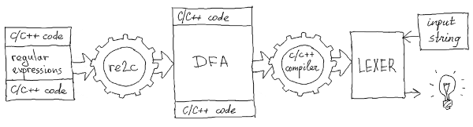
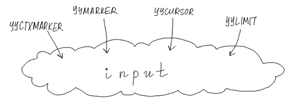
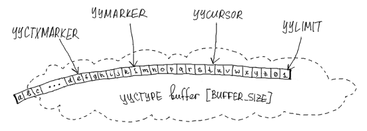

-----------------------------------
re2c input model: call for opinions
-----------------------------------

.. _RE2C: https://re2c.org

RE2C_ is a generator of lexical analyzers for C/C++.
It takes a description of regular expressions, transforms it to deterministic finite automaton (DFA)
and compiles DFA to C/C++ code, which is further compiled to binary.
The resulting program --- LEXER --- accepts a string of characters
and tries to match it against the regular expressions encoded in DFA.
If the match is successful, LEXER performs some actions (predefined by the programmer).

current input model: user-defined pointers
==========================================

LEXER operates on the input using four pointer-like primitives:

    +-------------+------+-----------------------------------------+
    | YYCURSOR    | ---> | current character                       |
    +-------------+------+-----------------------------------------+
    | YYLIMIT     | ---> | end of input                            |
    +-------------+------+-----------------------------------------+
    | YYMARKER    | ---> | backtrack position                      |
    +-------------+------+-----------------------------------------+
    | YYCTXMARKER | ---> | backtrack position for trailing context |
    +-------------+------+-----------------------------------------+

and a function-like primitive YYFILL(n), which is invoked when LEXER needs more input.

RE2C assumes that these primitives are defined by the programmer
so that LEXER can use them in the following contexts:

    ===
    ++YYCURSOR;
    yych = *YYCURSOR;
    yych = *++YYCURSOR;
    yych = *(YYMARKER = YYCURSOR);
    yych = *(YYMARKER = ++YCURSOR);
    YYMARKER = YYCURSOR;
    YYMARKER = ++YYCURSOR;
    YYCURSOR = YYMARKER;
    YYCTXMARKER = YYCURSOR + 1;
    YYCURSOR = YYCTXMARKER;
    if (YYLIMIT <= YYCURSOR) \...
    if ((YYLIMIT - YYCURSOR) < n) \...
    YYDEBUG (label, *YYCURSOR);
    ===

Each particular LEXER uses a subset of these cases, which depends on the complexity of regular expressions
and can be partially controlled by the programmer.

usual input: pointers to plain buffer
=====================================

The most obvious and efficient way to define pointer-like primitives is to make them simple pointers to a plain buffer:

Like this:

.. code-block:: c

    bool lex (const char * YYCURSOR, const char * const YYLIMIT)
    {
        const char * YYMARKER;
        const char * YYCTXMARKER;
    #   define YYCTYPE   char
    #   define YYFILL(n) {}
        /*!re2c
            "int buffer " / "[" [0-9]+ "]" { return true; }
            *                              { return false; }
        */
    }

    int main ()
    {
        const char buffer [] = "int buffer [1024]";
        return !lex (buffer, buffer + sizeof (buffer));
    }

unusual input: STL stream
=========================

Sometimes programmers want to give up efficiency for memory safety, simplicity and whatever else.
Why mess around with pointers to raw memory when we have STL streams?

RE2C can be used with any input model which can be expressed in terms of pointer-like primitives.
Say, we want to change the above example to work with std::istringstream.
All we need is an iterator with the following operations:

* dereference
* assignment
* prefix increment
* less-or-equal comparison
* addition of a constant offset
* substraction

And the following constraint:

* multiple iterators may be used simultaneously

None of standard iterators supports all the operations we need, so we can either
derive our iterator from a standard one or write it from scratch.
I did the latter:

.. code-block:: cpp

    #include <sstream>
    class ptr_t
    {
        std::istringstream * is_;
        std::streampos p_;

      public:
        ptr_t (std::istringstream * is, std::streampos p)
            : is_ (is)
            , p_ (p)
        {}

        int operator * ()
        {
            is_->seekg (p_);
            return is_->peek ();
        }

        ptr_t & operator ++ ()
        {
            p_ += 1;
            return * this;
        }

        ptr_t operator + (std::streamoff off)
        {
            return ptr_t (is_, p_ + off);
        }

        friend bool operator <= (const ptr_t & ptr1, const ptr_t & ptr2)
        {
            return ptr1.p_ <= ptr2.p_;
        }

        friend std::streamoff operator - (const ptr_t & ptr1, const ptr_t & ptr2)
        {
            return ptr1.p_ - ptr2.p_;
        }
    };

That's how we use it:

.. code-block:: c

    bool lex (ptr_t & YYCURSOR, ptr_t & YYLIMIT)
    {
        ptr_t YYMARKER    = YYCURSOR;
        ptr_t YYCTXMARKER = YYCURSOR;
    #   define YYCTYPE   char
    #   define YYFILL(n) {}
        /*!re2c
            "int buffer " / "[" [0-9]+ "]" { return true; }
            *                              { return false; }
        */
    }

    int main ()
    {
        const char buffer [] = "int buffer [1024]";
        std::istringstream is (buffer);
        ptr_t cursor (&is, 0);
        ptr_t limit  (&is, sizeof (buffer));
        return !lex (cursor, limit);
    }

re2c input API: critique
========================

Have a look again at how RE2C uses pointer-like primitives:

    ===
    ++YYCURSOR;
    yych = *YYCURSOR;
    yych = *++YYCURSOR;
    yych = *(YYMARKER = YYCURSOR);
    yych = *(YYMARKER = ++YCURSOR);
    YYCURSOR = YYMARKER;
    YYCURSOR = YYCTXMARKER;
    YYMARKER = YYCURSOR;
    YYMARKER = ++YYCURSOR;
    YYCTXMARKER = YYCURSOR + 1;
    if (YYLIMIT <= YYCURSOR) \...
    if ((YYLIMIT - YYCURSOR) < n) \...
    YYDEBUG (label, *YYCURSOR);
    ===

It seems that some cases are redundant: they could be expressed via other cases and reduced.
In fact, RE2C only needs these basic operations:

    +------------------------------------+--------------------------------------------+
    | ++YYCURSOR                         | get current character                      |
    +------------------------------------+--------------------------------------------+
    | *YYCURSOR                          | advance to the next character              |
    +------------------------------------+--------------------------------------------+
    | YYMARKER = YYCURSOR                | backup input position                      |
    +------------------------------------+--------------------------------------------+
    | YYCTXMARKER = YYCURSOR             | backup input position of trailing context  |
    +------------------------------------+--------------------------------------------+
    | YYCURSOR = YYMARKER                | restore input position                     |
    +------------------------------------+--------------------------------------------+
    | YYCURSOR = YYCTXMARKER             | restore input position of trailing context |
    +------------------------------------+--------------------------------------------+
    | if ((YYLIMIT - YYCURSOR) < n) \... | ensure that enough characters are left     |
    +------------------------------------+--------------------------------------------+

And all the cases above could be expressed via them:

    +------------------------------------+------+----------------------------------------------------+
    | ++YYCURSOR;                        | ---> | ++YYCURSOR;                                        |
    +------------------------------------+------+----------------------------------------------------+
    | yych = *YYCURSOR;                  | ---> | yych = *YYCURSOR;                                  |
    +------------------------------------+------+----------------------------------------------------+
    | yych = *++YYCURSOR;                | ---> | ++YYCURSOR; yych = *YYCURSOR;                      |
    +------------------------------------+------+----------------------------------------------------+
    | yych = *(YYMARKER = YYCURSOR);     | ---> | YYMARKER = YYCURSOR; yych = *YYCURSOR;             |
    +------------------------------------+------+----------------------------------------------------+
    | yych = *(YYMARKER = ++YCURSOR);    | ---> | ++YYCURSOR; YYMARKER = YYCURSOR; yych = *YYCURSOR; |
    +------------------------------------+------+----------------------------------------------------+
    | YYMARKER = YYCURSOR;               | ---> | YYMARKER = YYCURSOR;                               |
    +------------------------------------+------+----------------------------------------------------+
    | YYMARKER = ++YYCURSOR;             | ---> | ++YYCURSOR; YYMARKER = YYCURSOR;                   |
    +------------------------------------+------+----------------------------------------------------+
    | YYCURSOR = YYMARKER;               | ---> | YYCURSOR = YYMARKER;                               |
    +------------------------------------+------+----------------------------------------------------+
    | YYCTXMARKER = YYCURSOR + 1;        | ---> | YYCTXMARKER = YYCURSOR;                            |
    +------------------------------------+------+----------------------------------------------------+
    | YYCURSOR = YYCTXMARKER;            | ---> | YYCURSOR = YYCTXMARKER; ++YYCURSOR;                |
    +------------------------------------+------+----------------------------------------------------+
    | if (YYLIMIT <= YYCURSOR) \...      | ---> | if ((YYLIMIT - YYCURSOR) < 1) \...                 |
    +------------------------------------+------+----------------------------------------------------+
    | if ((YYLIMIT - YYCURSOR) < n) \... | ---> | if ((YYLIMIT - YYCURSOR) < n) \...                 |
    +------------------------------------+------+----------------------------------------------------+
    | YYDEBUG (label, *YYCURSOR);        | ---> | YYDEBUG (label, *YYCURSOR);                        |
    +------------------------------------+------+----------------------------------------------------+

Then we could write a much better implementation of 'ptr_t':

.. code-block:: cpp

    #include <sstream>
    class ptr_t
    {
        std::istringstream & is_;

      public:
        explicit ptr_t (std::istringstream & is)
            : is_ (is)
        {}

        ptr_t & operator ++ ()
        {
            is_.ignore ();
            return * this;
        }

        int operator * ()
        {
            return is_.peek ();
        }

        operator std::streampos ()
        {
            return is_.tellg ();
        }

        ptr_t & operator = (std::streampos p)
        {
            is_.seekg (p);
            return *this;
        }
    };
And use it like this:

.. code-block:: c

    bool lex (ptr_t & YYCURSOR, std::streampos YYLIMIT)
    {
        std::streampos YYMARKER;
        std::streampos YYCTXMARKER;
    #   define YYCTYPE   char
    #   define YYFILL(n) {}
        /*!re2c
            "int buffer " / "[" [0-9]+ "]" { return true; }
            *                              { return false; }
        */
    }

    int main ()
    {
        const char buffer [] = "int buffer [1024]";
        std::istringstream is (buffer);
        ptr_t cursor (is);
        return !lex (cursor, sizeof (buffer));
    }

This implementation is clearly more efficient
(no need to manually track and adjust input position)
and simpler (we got rid of some operators).

what I suggest
==============

So my first attempt was that simple: rewrite RE2C code generator to express all input actions in terms of basic operations.
There is a whole `article </posts/re2c/2015-01-14-input_model_assembly.html>`_ about why I abandoned this idea.
In short, it might introduce slight performance regressions in rare cases.

Still I felt bad about current state of affairs
(simplified API was `requested <https://sourceforge.net/p/re2c/feature-requests/21/>`_ by one of RE2C users).
Then at some point I realized that there's no need to change default code generation at all.
We can simply hide the new API behind a switch:

    ===
    \--input < default | custom | istream >
    ===

* With "\--input default" (enabled by default) RE2C will generate exactly the same code as before.

* With "\--input custom" RE2C will express all input actions in terms of the following basic operations:

    +-----------------+--------------------------------------------+
    | YYPEEK ()       | get current character                      |
    +-----------------+--------------------------------------------+
    | YYSKIP ()       | advance to the next character              |
    +-----------------+--------------------------------------------+
    | YYBACKUP ()     | backup input position                      |
    +-----------------+--------------------------------------------+
    | YYBACKUPCTX ()  | backup input position of trailing context  |
    +-----------------+--------------------------------------------+
    | YYRESTORE ()    | restore input position                     |
    +-----------------+--------------------------------------------+
    | YYRESTORECTX () | restore input position of trailing context |
    +-----------------+--------------------------------------------+
    | YYLESSTHAN (n)  | check if less than 'n' characters are left |
    +-----------------+--------------------------------------------+

  This is a very generic API: it uses a bare minimum of operations needed by RE2C and makes no additional assumptions about input semantics.
  Usage examples `here </posts/re2c/2015-01-15-input_model_custom.html>`_.

* With "\--input istream" RE2C will automatically define the above operations:

    +-----------------+------+---------------------------------+
    | YYPEEK ()       | ---> | YYCURSOR.peek ()                |
    +-----------------+------+---------------------------------+
    | YYSKIP ()       | ---> | YYCURSOR.ignore ()              |
    +-----------------+------+---------------------------------+
    | YYBACKUP ()     | ---> | YYMARKER = YYCURSOR.tellg ()    |
    +-----------------+------+---------------------------------+
    | YYBACKUPCTX ()  | ---> | YYCTXMARKER = YYCURSOR.tellg () |
    +-----------------+------+---------------------------------+
    | YYRESTORE ()    | ---> | YYCURSOR.seekg (YYMARKER)       |
    +-----------------+------+---------------------------------+
    | YYRESTORECTX () | ---> | YYCURSOR.seekg (YYCTXMARKER)    |
    +-----------------+------+---------------------------------+
    | YYLESSTHAN (n)  | ---> | YYLIMIT - YYCURSOR.tellg () < n |
    +-----------------+------+---------------------------------+

  Example program becomes that simple:

  .. code-block:: c

    #include <sstream>

    bool lex (std::istringstream & YYCURSOR, const std::streampos YYLIMIT)
    {
        std::streampos YYMARKER;
        std::streampos YYCTXMARKER;
    #   define YYCTYPE   char
    #   define YYFILL(n) {}
        /*!re2c
            "int buffer " / "[" [0-9]+ "]" { return true; }
            *                              { return false; }
        */
    }

    int main ()
    {
        const char buffer [] = "int buffer [1024]";
        std::istringstream is (buffer);
        return !lex (is, sizeof (buffer));
    }

Exposing input API this way has another important advantage over pointer-like API:
compilation errors about undefined symbols are much shorter and easier to comprehend than multi-page compiler dumps
about missing or ambiguous operators.

a call for opinions
===================

So what do you think of it?
Any ideas?
Any suggestions?
Any esoteric input models that don't fit into this API?
I'd be glad to hear.

The best place for discussion is `re2c-devel <mailto:re2c-devel@lists.sourceforge.net>`_
and `re2c-general <mailto:re2c-general@lists.sourceforge.net>`_ mailing lists,
but you can also e-mail me `in private <mailto:skvadrik@gmail.com>`_ or drop a comment below.

Meanwhile, I created a `branch <https://sourceforge.net/p/re2c/code-git/ci/new_input_model/tree/>`_ for the new API, so you can try it out yourself.

thanks to
=========

* Rui Maciel for arousing the question of using RE2C with unusual input models
* Dan Nuffer for explaining how RE2C can be adapted to different input models
  and pointing at possible speed regressions
* Sergey Trofimovich for pointing at backward compatibility issues
  and helping with compiler dumps

updates
=======

* 2015-02-23:
  After some discussion on re2c mailing lists I realized that generic implementation of
  "\--input istream" is impossible: some std::istream types don't support seek operations (e.g. std::cin).
  Generic implementation must also do error handling, so it would be bloated and inefficient.
  So for now, omit "\-- input istream".

* 2015-02-23:
  Renamed 'YYHAS(n)' to 'YYLESSTHAN(n)'.
  This primitive actually means "is there less than 'n' input characters left?"
