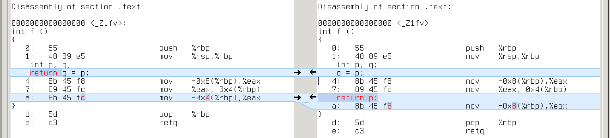
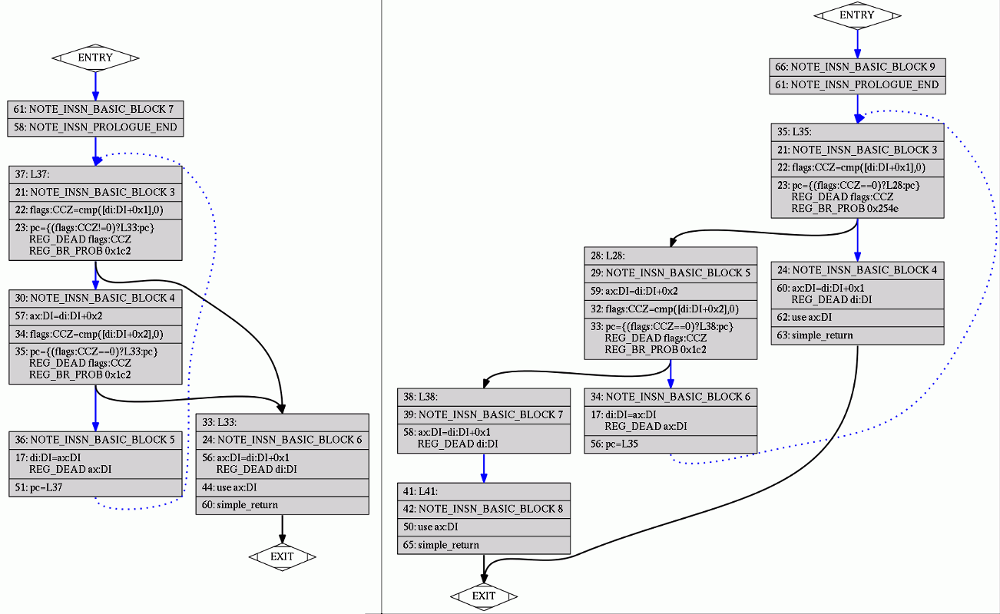
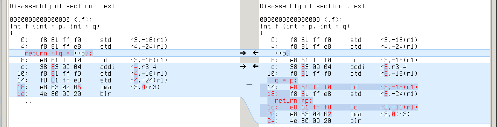

-----------------------------------------
comparing assembly for similar C/C++ code
-----------------------------------------

.. _RE2C: http://re2c.org/manual.html

.. _GENERIC: https://gcc.gnu.org/onlinedocs/gccint/GENERIC.html#GENERIC

.. _GIMPLE: https://gcc.gnu.org/onlinedocs/gccint/GIMPLE.html#GIMPLE

.. _RTL: https://gcc.gnu.org/onlinedocs/gccint/RTL.html#RTL

.. _objdump: https://en.wikipedia.org/wiki/Objdump

.. _diff: https://en.wikipedia.org/wiki/Diff_utility

.. _meld: http://meldmerge.org/

What is more efficient:

.. code-block:: c++

    c = *(q = ++p);

or

.. code-block:: c++

    ++p;
    q = p;
    c = *p;

?

I came across this while thinking about `RE2C input model </posts/re2c/2015-01-13-input_model.html>`_.
RE2C_ generates complex expressions to manipulate input stream:

    ===
    yych = *++YYCURSOR;
    yych = *(YYMARKER = YYCURSOR);
    yych = *(YYMARKER = ++YYCURSOR);
    YYMARKER = ++YYCURSOR;
    ===

I wanted to reduce the number of basic operations on input, so I decided to simplify these expressions:

    +----------------------------------+------+----------------------------------------------------+
    | yych = *++YYCURSOR;              | ---> | ++YYCURSOR; yych = *YYCURSOR;                      |
    +----------------------------------+------+----------------------------------------------------+
    | yych = *(YYMARKER = YYCURSOR);   | ---> | YYMARKER = YYCURSOR; yych = *YYCURSOR;             |
    +----------------------------------+------+----------------------------------------------------+
    | yych = *(YYMARKER = ++YYCURSOR); | ---> | ++YYCURSOR; YYMARKER = YYCURSOR; yych = *YYCURSOR; |
    +----------------------------------+------+----------------------------------------------------+
    | YYMARKER = ++YYCURSOR;           | ---> | ++YYCURSOR; YYMARKER = YYCURSOR;                   |
    +----------------------------------+------+----------------------------------------------------+

This transformation is perfectly valid from C/C++ standpoint.
Yet it can affect performance: compilers may prefer one case to the other.
Let's go down to assembly and find out. :)

I'll keep to the following plan:

* take RE2C test collection
* pick those tests which reveal difference in RE2C-generated code
* compile both cases (using various compiler/optimizations/target configurations)
* objdump_ object files
* diff_ assembly
* investigate the difference (I will use small examples cut from real programs and meld_).

gcc
===

gcc-4.9.2:

    +-----+-----------+----------+-----------+-----------+-----------+-----------+-----------+-----------+
    |     |           | compiled | different | different | different | different | different | different |
    |     |           |          | -O0       | -O1       | -O2       | -O3       | -Ofast    | -Os       |
    |     |           |          |           |           |           |           |           |           |
    +-----+-----------+----------+-----------+-----------+-----------+-----------+-----------+-----------+
    |     | x86_64    | 228      | 140       | 0         | 1         | 0         | 0         | 0         |
    +-----+-----------+----------+-----------+-----------+-----------+-----------+-----------+-----------+
    |     | x86       | 228      | 140       | 0         | 0         | 0         | 0         | 0         |
    +-----+-----------+----------+-----------+-----------+-----------+-----------+-----------+-----------+
    |     | mingw64   | 227      | 139       | 0         | 1         | 0         | 0         | 0         |
    +-----+-----------+----------+-----------+-----------+-----------+-----------+-----------+-----------+
    |     | mingw32   | 227      | 139       | 0         | 0         | 0         | 0         | 0         |
    +-----+-----------+----------+-----------+-----------+-----------+-----------+-----------+-----------+
    |     | alpha     | 228      | 140       | 0         | 1         | 0         | 0         | 0         |
    +-----+-----------+----------+-----------+-----------+-----------+-----------+-----------+-----------+
    |     | armv5tel  | 228      | 140       | 0         | 0         | 0         | 0         | 0         |
    +-----+-----------+----------+-----------+-----------+-----------+-----------+-----------+-----------+
    |     | armv7a    | 228      | 140       | 0         | 0         | 0         | 0         | 0         |
    +-----+-----------+----------+-----------+-----------+-----------+-----------+-----------+-----------+
    |     | ia64      | 228      | 140       | 0         | 0         | 0         | 0         | 0         |
    +-----+-----------+----------+-----------+-----------+-----------+-----------+-----------+-----------+
    |     | mips64    | 228      | 140       | 0         | 0         | 0         | 0         | 0         |
    +-----+-----------+----------+-----------+-----------+-----------+-----------+-----------+-----------+
    |     | powerpc64 | 228      | 140       | 0         | 1         | 0         | 0         | 0         |
    +-----+-----------+----------+-----------+-----------+-----------+-----------+-----------+-----------+
    |     | powerpc   | 228      | 140       | 0         | 0         | 0         | 0         | 0         |
    +-----+-----------+----------+-----------+-----------+-----------+-----------+-----------+-----------+
    |     | s390x     | 228      | 140       | 0         | 1         | 0         | 0         | 0         |
    +-----+-----------+----------+-----------+-----------+-----------+-----------+-----------+-----------+
    |     | sparc64   | 228      | 140       | 0         | 1         | 0         | 0         | 0         |
    +-----+-----------+----------+-----------+-----------+-----------+-----------+-----------+-----------+

gcc-4.8.3:

    +-----+-----------+----------+-----------+-----------+-----------+-----------+-----------+-----------+
    |     |           | compiled | different | different | different | different | different | different |
    |     |           |          | -O0       | -O1       | -O2       | -O3       | -Ofast    | -Os       |
    |     |           |          |           |           |           |           |           |           |
    +-----+-----------+----------+-----------+-----------+-----------+-----------+-----------+-----------+
    |     | x86_64    | 228      | 140       | 19        | 19        | 19        | 19        | 19        |
    +-----+-----------+----------+-----------+-----------+-----------+-----------+-----------+-----------+
    |     | x86       | 228      | 140       | 19        | 19        | 19        | 19        | 19        |
    +-----+-----------+----------+-----------+-----------+-----------+-----------+-----------+-----------+
    |     | mingw64   | 227      | 139       | 19        | 19        | 19        | 19        | 19        |
    +-----+-----------+----------+-----------+-----------+-----------+-----------+-----------+-----------+
    |     | mingw32   | 227      | 139       | 19        | 19        | 19        | 19        | 19        |
    +-----+-----------+----------+-----------+-----------+-----------+-----------+-----------+-----------+
    |     | alpha     | 228      | 140       | 19        | 11        | 11        | 11        | 9         |
    +-----+-----------+----------+-----------+-----------+-----------+-----------+-----------+-----------+
    |     | armv5tel  | 228      | 140       | 19        | 19        | 19        | 19        | 19        |
    +-----+-----------+----------+-----------+-----------+-----------+-----------+-----------+-----------+
    |     | armv7a    | 228      | 140       | 19        | 19        | 19        | 19        | 19        |
    +-----+-----------+----------+-----------+-----------+-----------+-----------+-----------+-----------+
    |     | ia64      | 228      | 140       | 19        | 11        | 11        | 11        | 6         |
    +-----+-----------+----------+-----------+-----------+-----------+-----------+-----------+-----------+
    |     | mips64    | 228      | 140       | 19        | 19        | 19        | 19        | 19        |
    +-----+-----------+----------+-----------+-----------+-----------+-----------+-----------+-----------+
    |     | powerpc64 | 228      | 140       | 19        | 19        | 19        | 19        | 19        |
    +-----+-----------+----------+-----------+-----------+-----------+-----------+-----------+-----------+
    |     | powerpc   | 228      | 140       | 19        | 19        | 19        | 19        | 19        |
    +-----+-----------+----------+-----------+-----------+-----------+-----------+-----------+-----------+
    |     | s390x     | 228      | 140       | 19        | 19        | 19        | 19        | 19        |
    +-----+-----------+----------+-----------+-----------+-----------+-----------+-----------+-----------+
    |     | sparc64   | 228      | 140       | 19        | 19        | 19        | 19        | 19        |
    +-----+-----------+----------+-----------+-----------+-----------+-----------+-----------+-----------+

So what do we have here?

-O0
---
--------------------------------------------------------------------------------

On -O0 GCC-4.8.3 and GCC-4.9.2 are unanimous: many files differ, but in most cases instructions remain the same.
What differs is the offset of YYCURSOR and YYMARKER on stack.
Like in this simple example:

.. image:: images/input_model_assembly/asm_gcc_o0_stack_source.png

x86_64: q's address is -0x4(%rbp), while p's is -0x8(%rbp)

alpha: q's address is 20(fp), while p's is 16(fp)

.. image:: images/input_model_assembly/asm_gcc_o0_stack_alpha.png

armv7a: q's address is [fp,#-8], while p's is [fp,#-12]

.. image:: images/input_model_assembly/asm_gcc_o0_stack_armv7a.png

mips64: q's address is 12(s8), while p's is 8(s8)

powerpc: q's address is 28(r31), while p's is 24(r31)

.. image:: images/input_model_assembly/asm_gcc_o0_stack_powerpc.png

s390x: q's address is 160(%r11), while p's is 164(%r11)

.. image:: images/input_model_assembly/asm_gcc_o0_stack_s390x.png

sparc64: q's address is [%fp+0x7f7], while p's is [%fp+0x7fb]

.. image:: images/input_model_assembly/asm_gcc_o0_stack_sparc64.png

ia64: q's address is [r2+4], while p's is [r2] (extra 'adds r14=4,r2' to compute r2+4)

.. image:: images/input_model_assembly/asm_gcc_o0_stack_ia64.png

Real difference appears in cases where YYCURSOR and YYMARKER have different
level of indirection (say, YYCURSOR is of type 'char \*' and YMARKER is of type 'char \**').
It leads to one extra/missing load from memory. Like this:

.. image:: images/input_model_assembly/asm_gcc_o0_load_source.png

x86_64: \*q requires one more 'mov (%rax),%eax' than p

alpha: same with 'ldl t0,0(t0)'

armv7a: same with 'ldr r3,[r3]'

mips64: same with 'lw v0,0(v0)'

.. image:: images/input_model_assembly/asm_gcc_o0_load_mips64.png

powerpc: same with 'lwz r9,0(r9)'

.. image:: images/input_model_assembly/asm_gcc_o0_load_powerpc.png

s390x: same with 'l %r1,0(%r1)'

.. image:: images/input_model_assembly/asm_gcc_o0_load_s390x.png

sparc64: same with 'ld [%g1],%g1'

.. image:: images/input_model_assembly/asm_gcc_o0_load_sparc64.png

ia64: same with 'ld4 r14=[r14]'

Another group of differences is jump length (it may vary because of extra/missing instructions and varying length of instructions).

And that's all for -O0: the code is a trivial reflection of C/C++ source,
so one can hardly judge it in terms of efficiency.

-O1
---
--------------------------------------------------------------------------------

Here things start to get interesting: no difference with GCC-4.9.2, but 19 different cases with GCC-4.8.3.
Comparing the assembly doesn't help much: looks like GCC-4.8.3 failed to deduplicate code in the second case:

.. image:: images/input_model_assembly/asm_gcc_o1_source.png

x86_64:

.. image:: images/input_model_assembly/asm_gcc_o1_x86_64.png

alpha:

armv7a:

.. image:: images/input_model_assembly/asm_gcc_o1_armv7a.png

mips64:

.. image:: images/input_model_assembly/asm_gcc_o1_mips64.png

powerpc:

.. image:: images/input_model_assembly/asm_gcc_o1_powerpc.png

s390x:

.. image:: images/input_model_assembly/asm_gcc_o1_s390x.png

sparc64:

ia64:

.. image:: images/input_model_assembly/asm_gcc_o1_ia64.png

GCC-4.9.2 generates the same code in both cases (without duplicates).

Why difference with GCC-4.8.3?
It's hard to tell from the assembly.
We need to trace program transformations one by one.

GCC holds the program through three intermediate representations: GENERIC_ ---> GIMPLE_ ---> RTL_.
Optimizations are mostly done in GIMPLE (target and language independent) and RTL (low-level).
We can dump GIMPLE passes with "-fdump-tree-all" and RTL passes with "-fdump-rtl-all".

Since difference remains the same on all targets, it's likely to emerge in one of GIMPLE passes.
Both GCC-4.9.2 and GCC-4.8.3 generate the same dumps up to first forward propagation pass (.forwprop1):

Howevwer, forward propagation with GCC-4.9.2 erases the difference:

.. image:: images/input_model_assembly/asm_gcc_o1_gimple_forwprop1_492.png

While with GCC-4.8.3 it's getting worse:

So that subsequent copy propagation pass (.copyprop1) fails on second file:

.. image:: images/input_model_assembly/asm_gcc_o1_gimple_copyprop1_483.png

Looks like a bug in forward propagation.
All these 19 tests which reveal this bug are actually different variants of the same test:
they all reduce use of YYMARKER from two times to one, so that YYMARKER becomes a single-use variable.
This is kind of a rare case.

I searched for commit that fixes forward propagation in GCC:

.. code-block:: bash

    $ git clone git://gcc.gnu.org/git/gcc.git
    $ cd git
    $ git log origin/gcc-4_8-branch..origin/gcc-4_9-branch tree-ssa-forwprop.c

And soon found `this one <https://gcc.gnu.org/git/gitweb.cgi?p=gcc.git;a=commitdiff;h=bfb89138de98b366acd107bbcc502febf7566991>`_
(verifying was easy after I learned to `quickly build GCC from source </posts/util/2015-01-12-gcc_quick_build.html>`_).

-O2 and higher
--------------
--------------------------------------------------------------------------------

With GCC-4.9.2 there's almost no difference.
There is only one different case, it differs only with -O2, only on some targets, and the difference is immaterial ---
swapped comparison operands and inverted jump condition:

x86_64:

.. image:: images/input_model_assembly/asm_gcc_o2_492_x86_64.png

alpha:

.. image:: images/input_model_assembly/asm_gcc_o2_492_alpha.png

powerpc64:

.. image:: images/input_model_assembly/asm_gcc_o2_492_powerpc64.png

s390x:

sparc64:

.. image:: images/input_model_assembly/asm_gcc_o2_492_sparc64.png

With GCC-4.8.3 we see the same 19 cases: the difference creeps in with first forward propagation,
outlives all GIMPLE optimizations and fades in RTL (sometimes completely).

It's hard to read RTL dumps, but with "-fdump-rtl-all-graph" GCC will generate a picture for each RTL pass.
We can trace which RTL passes erase the difference in our example on, say, x86_64:

.. image:: images/input_model_assembly/asm_gcc_o1_source.png

Up to second control flow graph cleanup (.jump2) pass programs were that different:

Half of the difference erased by control flow graph cleanup:

.. image:: images/input_model_assembly/asm_gcc_o2_rtl_jump2.png

Difference completely gone after basic block reordering (.bbro) pass:

.. image:: images/input_model_assembly/asm_gcc_o2_rtl_bbro.png

Nice pictures.

conclusion
----------
--------------------------------------------------------------------------------

So what do we have after all?
No performance regressions with GCC-4.9.2.
Some very rare regressions due to a forward propagation bug in GCC-4.8.3, which almost vanish on -O2 and higher.

clang
=====

clang-3.6.0:

    +-----+-----------+----------+-----------+-----------+-----------+-----------+-----------+-----------+
    |     |           | compiled | different | different | different | different | different | different |
    |     |           |          | -O0       | -O1       | -O2       | -O3       | -Ofast    | -Os       |
    |     |           |          |           |           |           |           |           |           |
    +-----+-----------+----------+-----------+-----------+-----------+-----------+-----------+-----------+
    |     | x86_64    | 227      | 224       | 20        | 18        | 18        | 18        | 18        |
    +-----+-----------+----------+-----------+-----------+-----------+-----------+-----------+-----------+
    |     | armv7a    | 220      | 217       | 15        | 4         | 4         | 4         | 4         |
    +-----+-----------+----------+-----------+-----------+-----------+-----------+-----------+-----------+
    |     | powerpc64 | 220      | 217       | 19        | 8         | 8         | 8         | 8         |
    +-----+-----------+----------+-----------+-----------+-----------+-----------+-----------+-----------+

-O0
---
--------------------------------------------------------------------------------

Unlike GCC, CLANG is sensitive to decomposition of complex expressions.
In the example below, first program gets intermediate result from register,
while second program always loads it from stack:

x86_64: repeated 'mov -0x4(%rbp),%rsi' on the right vs %rdi on the left

.. image:: images/input_model_assembly/asm_clang_o0_x86_64.png

armv7a: repeated 'ldr r0,[sp,#4]' on the right vs r1 on the left

powerpc64: repeated 'ld r3,-16(r1)' on the right vs r4 on the left

This difference emerges in almost all tests,
so CLANG with -O0 is a true performance regression (if only -O0 was about performance).

-O1
---
--------------------------------------------------------------------------------

With -O1 the difference disappears in most cases,
but it is still evident in programs with an extra layer of indirection.
We can induce it in our example:

.. image:: images/input_model_assembly/asm_clang_o1_source.png

x86_64: repeated 'mov (%rdi),%rax' on the right

.. image:: images/input_model_assembly/asm_clang_o1_x86_64.png

armv7a: repeated 'ldr rX,[r0]' on the right

powerpc64: repeated 'ld rX,0(r3)' on the right

So CLANG with -O1 still is a performance regression in some cases.

-O2 and higher
--------------
--------------------------------------------------------------------------------

Here difference finally fades.

On x86_64, all different cases are trivial.
Either length of some memory loads is changed:

.. image:: images/input_model_assembly/asm_clang_o2_x86_64_load.png

which may cause changes in jump offsets, or instructions are swapped:

.. image:: images/input_model_assembly/asm_clang_o2_x86_64_swapped.png

On armv7a we again see a few trivial differences with memory loads and swapped instructions.

On powerpc64, however, a strange 'clrlwi' emerges in all 8 different cases:

.. image:: images/input_model_assembly/asm_clang_o2_powerpc64_clrlwi.png

This seems completely pointless: 'clrlwi r5,r5,24' clears high-order 24 bits of r5,
but they are already cleared by 'lbz r5,1(r4)'.
`Bugreport <http://llvm.org/bugs/show_bug.cgi?id=22120>`_
and `fix <http://reviews.llvm.org/rL225584>`_.

conclusion
----------
--------------------------------------------------------------------------------

Performance regressions with -O0 and -O1.
No significant difference with -O2 and higher.

pcc
===

PCC is `Portable C compiler <http://pcc.ludd.ltu.se/>`_.

pcc-1.1.0:

    +-----+-----------+----------+-----------+-----------+
    |     |           | compiled | different | different |
    |     |           |          | -O0       | -O1       |
    |     |           |          |           |           |
    +-----+-----------+----------+-----------+-----------+
    |     | x86_64    | 39       | 39        | 24        |
    +-----+-----------+----------+-----------+-----------+

As most tests are written in C++, PCC could only compile 39 of them.

-O0
---
--------------------------------------------------------------------------------

Almost all different cases look the same. Like this:

.. image:: images/input_model_assembly/asm_pcc_o0_source.png

Memory/register move and register/register addition vs memory/register addition ---
not much difference.

.. image:: images/input_model_assembly/asm_pcc_o0_x86_64.png

-O0
---
--------------------------------------------------------------------------------

Most of the cases are trivial (they use different general purpose registers).
Some cases still differ in the same way as on -O0.

conclusion
----------
--------------------------------------------------------------------------------

No performance regressions.

tcc
===

TCC is `Tiny C compiler <http://bellard.org/tcc/>`_.

tcc-0.9.26:

    +-----+-----------+----------+-----------+
    |     |           | compiled | different |
    |     |           |          |           |
    |     |           |          |           |
    +-----+-----------+----------+-----------+
    |     | x86_64    | 40       | 40        |
    +-----+-----------+----------+-----------+

TCC is not an optimizing compiler.

Like CLANG, TCC is sensitive to decomposition of complex expressions:

.. image:: images/input_model_assembly/asm_tcc_source.png

First program stores intermediate result in %rax, while second loads it from stack:

.. image:: images/input_model_assembly/asm_tcc_x86_64.png

Extra memory loads appear in all tests.

conclusion
----------
--------------------------------------------------------------------------------

Performance regressions.

nwcc
====

NWCC is `Nils Weller's C compiler <http://nwcc.sourceforge.net/>`_.

nwcc-0.8.2:

    +-----+-----------+----------+-----------+
    |     |           | compiled | different |
    |     |           |          |           |
    |     |           |          |           |
    +-----+-----------+----------+-----------+
    |     | x86_64    | 39       | 39        |
    +-----+-----------+----------+-----------+

NWCC has no optimizations yet.

Like CLANG and TCC, NWCC prefers complex expressions.
All tests differ in the same way:

.. image:: images/input_model_assembly/asm_nwcc_source.png

First program uses %r9 for intermediate result. Second program loads it from stack:

.. image:: images/input_model_assembly/asm_nwcc_x86_64.png

conclusion
----------
--------------------------------------------------------------------------------

Performance regressions.

conclusion
==========

*In general* with reasonable optimizatios there's no difference on real-life programs.

*Honestly* some performance regressions are still possible even with good optimizations,
see for example this `GCC bugreport <https://gcc.gnu.org/bugzilla/show_bug.cgi?id=64541>`_
and this `CLANG bugreport <http://llvm.org/bugs/show_bug.cgi?id=22123>`_ (both stuck with the same problem: pointer aliasing).
